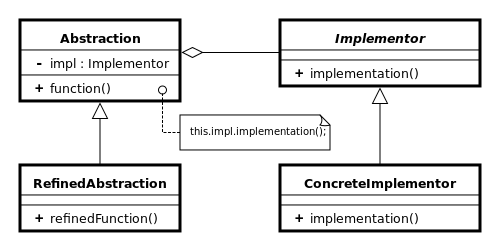

Padrões de Projeto
===================
Estudo de Design Patterns em Rust

Observer
---------
Permite incluir observadores de um certo tópico. Ao notificar é iterado uma lista de observadores contida dentro do tópico e disparado em cada um seu método de notificação

[link](/observer/src/main.rs)

Strategy
---------
Permite incluir novas formas de processamento. O contexto possui um tipo abstrato estratégia que recebe as implementações concretas.

[link](/strategy/src/main.rs)

Bridge
-------
Permite incluir dos dois lados novas implementações concretas.

[link](/bridge/src/main.rs)

